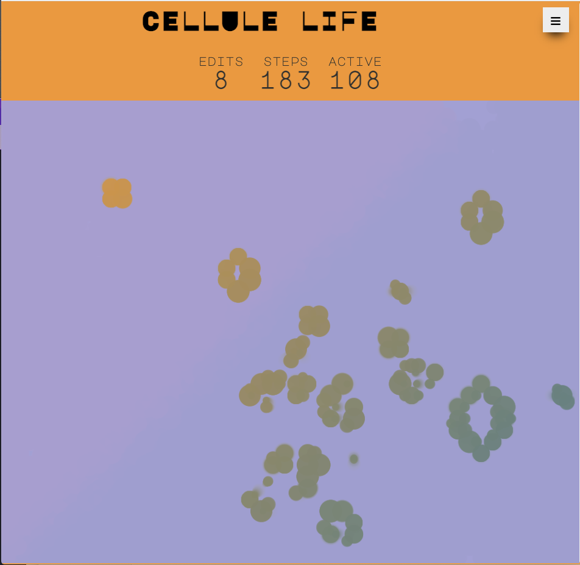

We made a Rust/Wasm Game called [CelluleLife](https://cellulelife.github.io/game/).

I have been hearing a lot about WASM lately. In fact, one of my favorite talks ever, [The Birth and Death of Javascript](https://www.destroyallsoftware.com/talks/the-birth-and-death-of-javascript), predicted all of this. WASI and other things will change the way we think about "Web Technologies".

On stream, we started looking into various tools and frameworks that would make things easier to set up. We found [Yew](https://yew.rs/) and [Seed](https://seed-rs.org/). Yew ended up feeling more familiar to me so we went with that.

We briefly considered Go but were deterred by the bundle size overhead due to having to ship a GC. It turns out [tinygo](https://tinygo.org/) would have alleviated these concerns but we didnt see it at the time.

A couple key takeaways about Yew:

- Yew felt very similar to an Angular app mixed with React jsx-style rendering via the html macro.

- The Agents felt like a nice clean way to share state among pages and components that felt very much like Angular Services.

- I didn't need to dive too much into how we do multi-threading but knowing that its available for me to optimize with later is comforting.

The game turned out pretty good. It is a gamification of [Conway's Game of Life](https://cellulelife.github.io/game/). Basically, you pick a starting seed. Then you modify it as much as you like and that amount of modifications is the high score list you would be fighting to get onto.

The goal is to have the longest life before reaching equilibirium. The amount of cells left alive end up being a tie breaker. So, if you modify a seed 3 times, you will be trying to get more steps than other people who only did 3 modifications.

Not the most exciting game, but it is suprisingly addictive.

