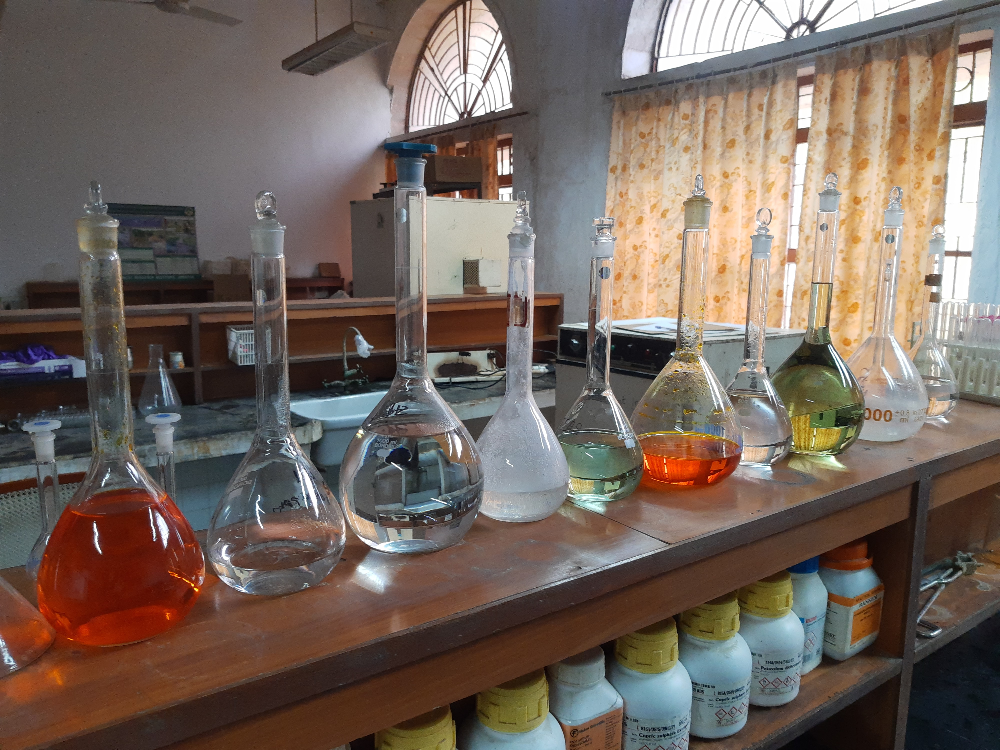

TL;DR: Build your Expo app with EAS and make Detox use that app file instead of Expo.

I'm working on a React Native app using the Expo managed flow. There are plenty of reasons why you might use Expo and there are plenty of other reasons why you might choose ejected React Native. This article will not go into those reasons. I will just assume that you are here because you are using the Expo managed flow as well.

When looking for E2E solutions to test your Expo app, your search will yield Appium and Detox. Detox is made by Wix and it makes the same optimization that Cypress and TestCafe have made for web e2e testing. That optimization is ditching WebDriver and it's opaque server/client process. By doing so, there is less (but still a non-zero) need for timeouts to handle flakiness of tests.

The problem is that Detox does not support the Expo managed flow and they don't plan on doing so as far as I know. Doing some searching, you will find articles about how to make it work, but in my experience they are usually outdated and the techniques they mention no longer work. Some of them even use stuff like `detox-expo-helpers`, but that repo hasn't seen an update in 3 years. I found a github repo that sets up some detox testing, but it resorts to a forked version of `detox-expo-helpers` as well as a timeout in the beforeAll. It just felt dirty to me.

The exact problem I was running into was that Detox would timeout because its synchronization was never seeing the onReady event get called even after I tried the hacky timeout approach. I'm guessing it's because it was trying to listen for the Expo app itself rather than my app inside Expo.

My "fix" is to build the application using EAS and then use that built app file instead of Expo for Detox. This isn't ideal but it works and without hacky timeouts. The downside is that I need to wait for the build queue in EAS.

Easy Peasy.

This then poses some complications for CI/CD. My plan is this:

- Make code change and push to trigger CI/CD
- CircleCI checks for app file in changes, if not present, trigger build.
- Use server to handle Build Webhook from EAS and commit that to retrigger CI/CD
- Since app is now part of changes, run Detox tests in pipeline using newest build

Is it perfect? No. But, it will work for me. I hope some of this was interesting and if you have some suggestions let me know on Twitter or in my Twitch stream.
