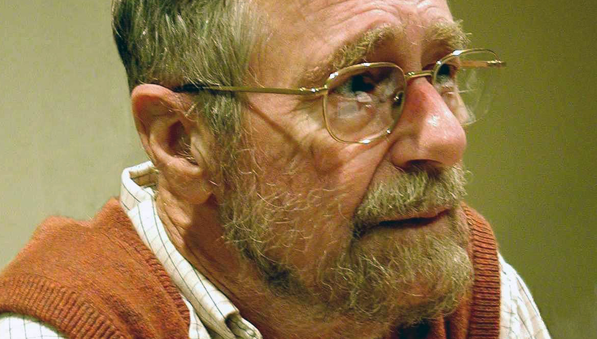
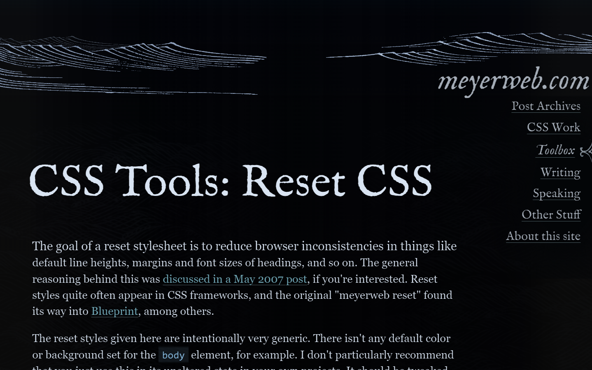

Very recently, in the PHP subreddit, someone posted about "Laravel Considered Harmful". Many of the complaints were just that, complaints. However, there were a couple points that I found agreeable. This post is NOT about Laravel, PHP, or any of those points made in the essay.

Instead, we will dig into what "Considered Harmful" posts are, their history, and why they keep getting made. We will even touch on a useful alternative.

If you prefer a video, you can check this out on my YouTube Channel:
`youtube: sXnifNpGSSI`

Most of what I am saying is directly from or inspired by reading an essay by Eric Meyer from over 20 years ago titled, "Considered Harmful Essays Considered Harmful".

## History

The Wikipedia article about ["Considered Harmful"](https://en.wikipedia.org/wiki/Considered_harmful) essays is deeper than one might expect. There is the history of it as well as a list of relevant example essays.

From Wikipedia:

> Considered harmful was popularized among computer scientists by Edsger Dijkstra's letter "Go To Statement Considered Harmful", published in the March 1968 Communications of the ACM (CACM), in which he criticized the excessive use of the GOTO statement in programming languages of the day and advocated structured programming instead.

One of the interesting things about the essay is that the title was not even of Dijkstra's own invention. Someone else slapped the famous title on it. The original title was, "A Case Against the Goto Statement". The editor knew what they were doing because "X Considered Harmful" is a catchy title.

## Eric Meyer

Considered Harmful essays have been considered harmful for over 20 years now. Eric Meyer has a famous essay about it on his website. You might recognize Eric Meyer's name from the CSS Reset he made that took the web by storm a decade or so ago. It made cross-browser design so much more consistent.

One interesting thing, is that Eric Meyer isn't even the first critique of Considered Harmful essays. In 1987, there was an essay title "'Goto Considered Harmful' Considered Harmful".

I think the most important thing that Eric Meyer's essay does is critique the value of such essays. He digs into their effects and specifically how users of the essay style end up harming their own arguments.

The motivations for such essays, he points out, are usually due to a number of things: Passion, Vengeance, or Time.

If you haven't read it, yet, go check out Eric's essay about the subject. They even make sure to poke a little fun at themselves and their use of the title for effect.

[https://meyerweb.com/eric/comment/chech.html](https://meyerweb.com/eric/comment/chech.html)

## Alternatives

I agree wholeheartedly with Eric's take that what we truly need are objective compare and contrast essays. They are something we have been taught how to do very early into our educations, but it seems like something that social media doesn't encourage these days since objectivity doesn't get clicks.

## Wrapping up

I haven't said very much new here today that hasn't been said before by more influential people, but I think some of these resources aren't shared broadly enough.

To finish up I will simply quote Eric Meyer's summary/conclusion:

> “Considered harmful” essays are not only a sad cliché at this stage of the game, they are counter-productive to reasoned debate and most often do far more harm than good to whatever cause they promote. It would therefore seem obvious that the only intelligent course of action is to abandon their use entirely, and instead look to more constructive forms of essay writing in the support of debate positions.
