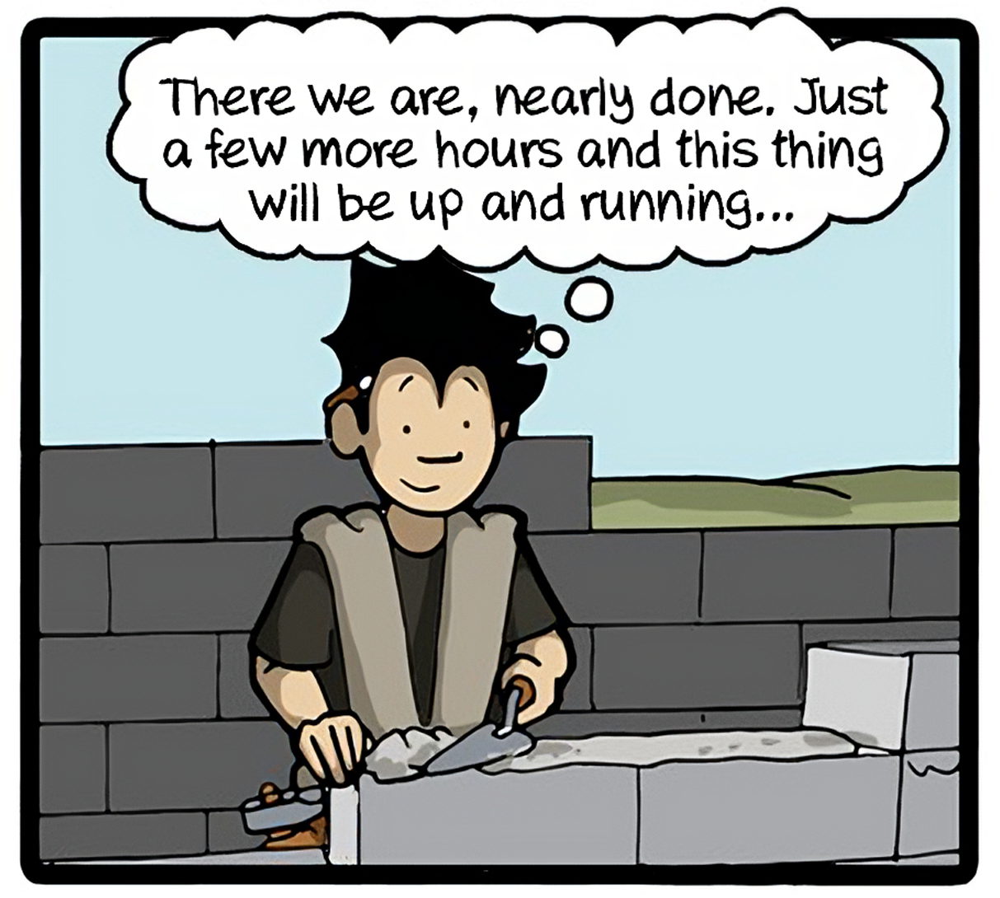
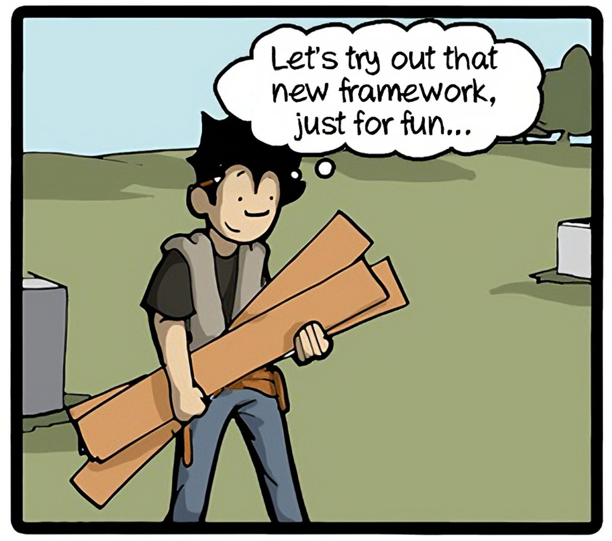
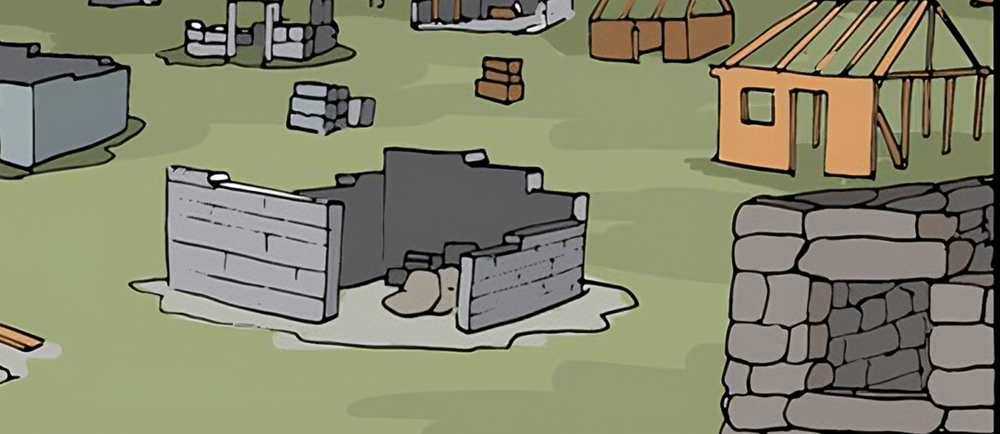
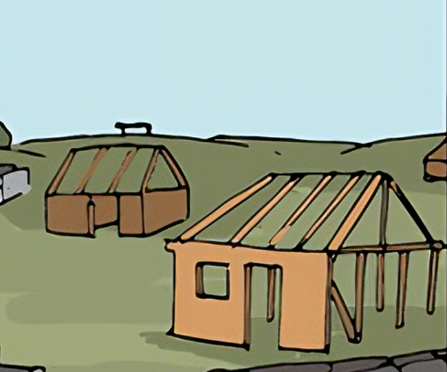
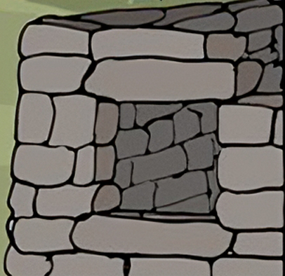
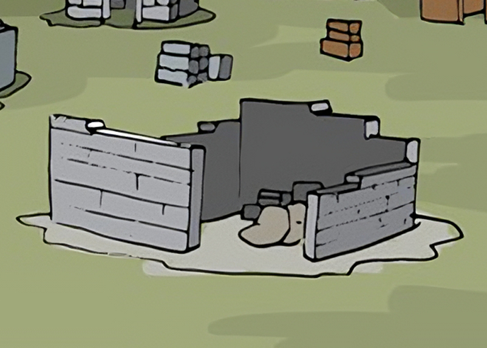
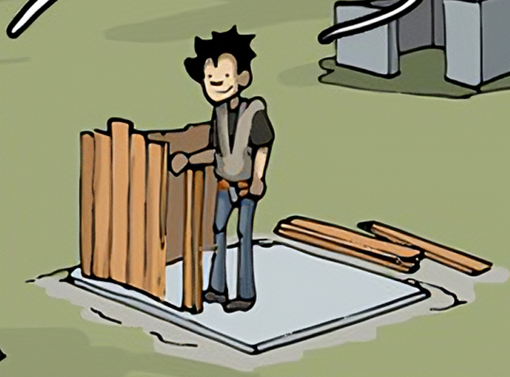

For people starting out in the software dev world, it can be really easy to fall into "Tutorial Hell". The common wisdom to avoid that is to start making things for yourself. Side projects are, indeed, the best way to solidify your learning. However, if you start enough side projects, it could start to feel like you never finish any.

<!-- youtube content goes here -->

## A Great Comic

The [CommitStrip](https://commitstrip.com) has an awesome comic about this that was released a few years ago. Please go check it out at its source. [https://www.commitstrip.com/en/2014/11/25/west-side-project-story/?](https://www.commitstrip.com/en/2014/11/25/west-side-project-story/?)

## Breaking It Down

There are some key things I want to point out, but we should at least break down the video a bit first.

At the start, we see a character laying out some mortar for some cinderblocks as part of a house they are building. It seems like they have made some good progress.

Then, they have a thought and decide to start on a different project using wood this time. They want to try out "that new framework".

Another character approaches and asks, "Starting another side project, are we?". The main character points out that they were almost done with the previous project, but they just wanted to try out this one little thing.

## The Graveyard

Most people have a graveyard of projects that will likely never get completed. This is OK! The thing we miss if we take the article at face value, is that there is a very clear progression from old to new.

We can see that early projects might be using some modern techniques but they completely missed setting up a foundation. That house would not be very sturdy and would likely not last very long.

The boulder based approach is a really old technique. They still gave it a shot and learned that it would probably be a bit drafty during the winters.

The previous project that was "almost finished" is definitely futher along than the other projects. But, we see a very hastily poured foundation.

Lastly, we see the current project. It has a nice clean-cut foundation. It also seems like the progress was made very quickly.

## The Takeaway

The thing to recognize is that this person got better and better at what they do every time. They might not have used the best techniques, but sometimes making a mistake is the easiest way to learn and understand something. Without making mistakes, how would we even know we did something right?

So, make projects you don't even plan on finishing because finishing isn't necessarily the point sometimes. Have fun with it. Eventually, you might look back at the projects you have started (and possibly abandoned) and see the progression to where you are now.
