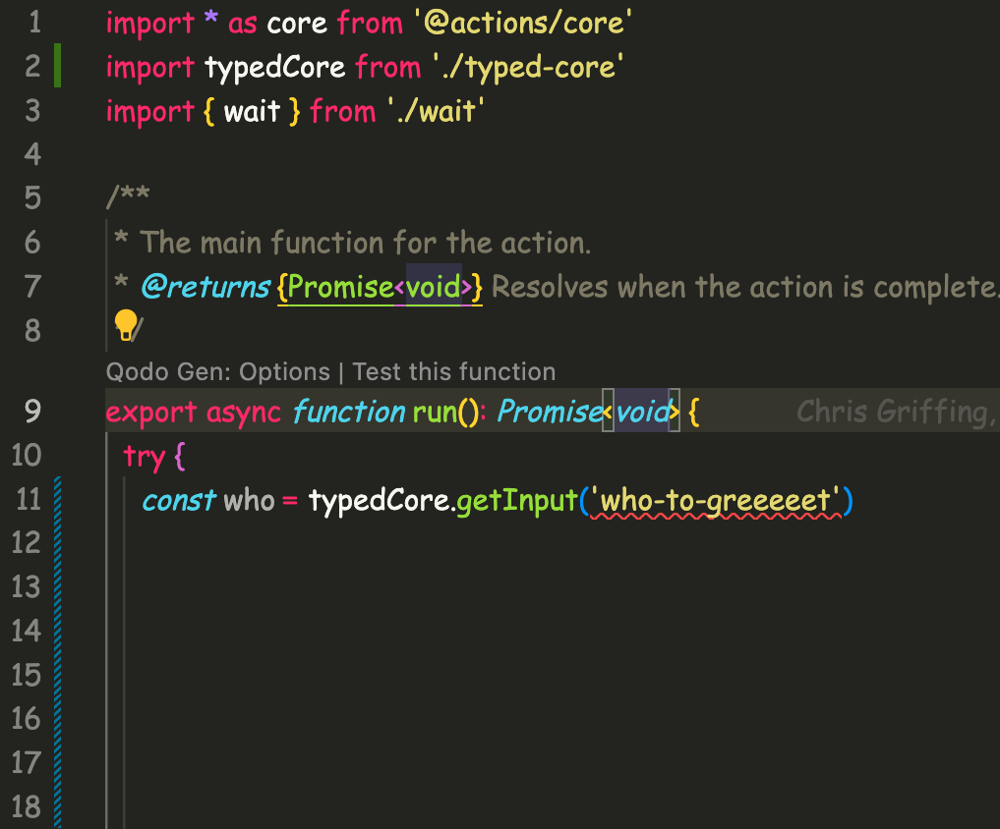

I was building a GitHub Action recently and I was annoyed by the lack of type safety for getting Inputs and setting Outputs. I decided to try and fix that and here is the result, a CLI tool to parse the actions.yml file and generate a wrapper around the 'core' module.

## The Problem

To understand  why this is a problem, let's take a look at an example `actions.yml` file.

```yaml
name: 'action'
description: 'Greet someone and record the time'
inputs:
  who-to-greet: # id of input
    description: 'Who to greet'
    required: true
    default: 'World'
outputs:
  time: # id of output
    description: 'The time we greeted you'
runs:
  using: 'node12'
  main: 'index.js'
```

In this file, we have an input called `who-to-greet` and an output called `time`. If you wanted to get access to the value of `who-to-greet` you would need to do something like this:

```typescript
const whoToGreet = core.getInput('who-to-greet');
```

If you wanted to set the value of the output, `time`, you would need to do something like this:

```typescript
core.setOutput('time', time);
```

The actual problem is that there is nothing that safeguards you from a typo in the name of the input or output. This would compile just fine even though the keys are invalid.

```typescript
const whoToGreet = core.getInput('who-to-greeeeeet');
core.setOutput('times', time);
```

## The Solution

To solve this problem, I decided to write a CLI tool that would parse the `actions.yml` file and generate a wrapper around the `core` module. This wrapper would have type-safe methods for getting and setting inputs and outputs.

At first, I thought I could make it work for numbers but I quickly realized that GitHub Actions don't support numbers as inputs or outputs. Technically you can use numbers but they are going to be converted to strings by the time you are trying to access them.

So, I decided to make it work for strings and booleans first. The result is pretty simple.

```sh
npx taction types ./actions.yml ./src/typed-core.ts
```

This will generate a file called `typed-core.ts` in the `./src` directory. This file will have type-safe methods for getting and setting inputs and outputs. The internals of that file would look something like this:

```typescript
import * as core from '@actions/core'

type StringInputs = 'who-to-greet'
type BooleanInputs = ''

type Outputs = 'time'

const typedCore = {
  ...core,
  getInput: (inputName: StringInputs): string => core.getInput(inputName),
  getBooleanInput: (inputName: BooleanInputs): boolean =>
    core.getBooleanInput(inputName),
  setOutput: (outputName: Outputs, value: any) =>
    core.setOutput(outputName, value)
}

export default typedCore;
```

That would give us type safety that shows up right in the editor like this:



If you want to check out the code, it is available on [GitHub](https://github.com/cmgriffing/taction) and you can start using the CLI tool right away by running `npx taction types ./actions.yml ./src/typed-core.ts`. The NPM page is [here](https://www.npmjs.com/package/taction).

## Conclusion

I hope this helps you write more type-safe GitHub Actions. I'm still working on the CLI tool but I think it is a great start. If you have any questions or comments, feel free to reach out to me on [one of my socials](https://cmgriffing.com).

