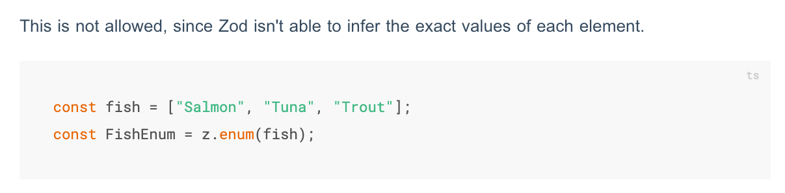
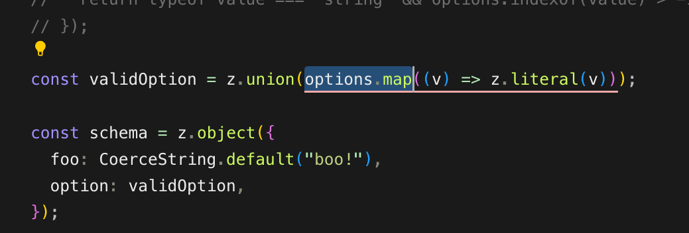

TL;DR: If you want to do validation of something being in a dynamic list of values you need to use `z.custom`. Here is the snippet:

```typescript
z.custom<T>((value) => {
  return YOUR_DYNAMIC_ARRAY.indexOf(value as T) > -1;
});
```

If you are curious why this is the case, read on.


Zod has a lot of very useful utility functions for creating a schema that helps you validate things at not just runtime, but also compile-time. This is what makes Zod unique. There have been many runtime validation libraries including [Joi](https://github.com/hapijs/joi), [yup](https://github.com/jquense/yup), [Parsley](https://parsleyjs.org/), and [validate.js](https://validatejs.org/) among many others.

Zod is typescript-native and by doing so it can know more about its schemas during development than most tools. Consider the usage of `z.infer` to get a legitimate TypeScript type from your validator.

This is a double-edged sword, though. It means that certain things are not as easy when using Zod out-of-the-box. One of those things is the idea of dynamically determined arrays. If you want to validate for a value being from an array you might use `z.enum`.

However, if you read the [docs for Zod enums](https://zod.dev/?id=zod-enums) you might notice that they require you to use `z.enum` directly or you can pass an array to `z.enum` as long as you define the array `as const`. This is because of Zod's compile-time behavior. If you keep reading in their docs, you will see that they cannot allow dynamic arrays because it breaks Zod's infer capabilities.



Why is that a problem? When would you want to use a dynamic array? Well, you might want to fetch some values from a third-party API on your backend and make sure that a value passed from your frontend to your API are part of that list. One example I have come across, is when using OpenAI models which can change over time.

## LLMs to the rescue?

Your next instinct might be to ask an LLM about how to do this with a dynamically determined array instead.

Perplexity gave 3 options. Only one of them is actually promising. (Part of why I really don't fear for my job at all)

The first option is this, and it is the only promising option. It allows you to map over the array and use `z.literal` with `z.union` to create the validator for that field.

```typescript
const createDynamicEnum = (values: string[]) =>
  z.union(values.map(v => z.literal(v)));

const dynamicEnum = createDynamicEnum(['a', 'b', 'c']);
```

However, it just doesn't work since it won't compile.



The next thing Perplexity recommended was this which doesn't even satisfy the requirements for being dynamic.

```typescript
const createEnumSchema = <T extends readonly [string, ...string[]]>(values: T) =>
  z.enum(values);

const allowedValues = ['a', 'b', 'c'] as const;
const schema = createEnumSchema(allowedValues);

```

It even tried to suggest another non-dynamic approach for object lists searched via properties.

```typescript
const properties = [
  { value: "entire_place", label: "The entire place" },
  { value: "private_room", label: "A private room" },
  { value: "shared_room", label: "A shared room" },
] as const;

const PropertyEnum = z.enum(properties.map(p => p.value));
type Property = z.infer<typeof PropertyEnum>;
```

So much for LLMs being able to take away developer jobs.

## What is the solution?

It turns out that Zod's `z.custom` is what we need. It will allow us to create a completely custom validation rule and as long as we return a boolean value out of it, we can evaluate anything we want.

Here it is again.

```typescript
z.custom<T>((value) => {
    return YOUR_DYNAMIC_ARRAY.indexOf(value as T) > -1;
  });
```

In this context, `YOUR_DYNAMIC_ARRAY`, is whatever array you want to search for a value in. You may even need to `.map` some array of objects to get to the array of values you want to search in.

It's such a simple bit of code that it might make sense why Zod hasn't included it in their standard library, even though it is so common among other libraries.  I hope you enjoyed reading this and I hope you take this and run with it. There is so much you can do with `z.custom` beyond just this.
