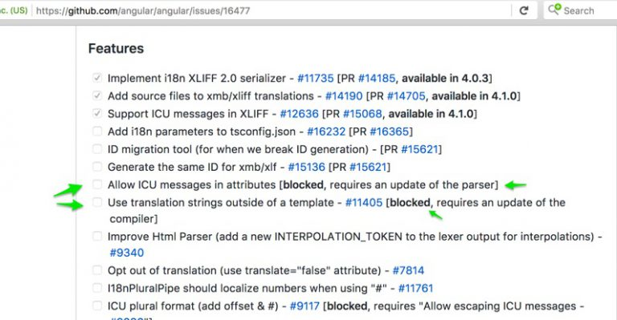

### The Gist

I've discovered a somewhat hacky way for using ICU Messages (Pluralization/Selection) in element attributes.

For those that just want to see the technique right away, here it is:

```html
<div hidden="">
  <!-- ICU selection message marked for translation -->
  <span #altvalue="" i18n="">
    {role, select, tinker {Tinker} tailor {Tailor} soldier {Soldier} spy {Spy}}
    Profile Image
  </span>
</div>

```

I will explain it further on in the post.

### A Brief Introduction to i18n with Angular

First off, here are some basics about Angular's i18n features for people who are unaware.

Angular has support for i18n as part of the framework. This takes away a lot of the guesswork of selecting an i18n tool. Additionally, it supports injecting translated messages into the templates for AOT builds.

The basics are that you add an `i18n` attribute to your elements in your template. Then, you use Angular's `ng-xi18n` command to generate an xlf file which can be passed onto translators to create a translated version for each language. This also works for element attributes like `alt` or `title` by adding `i18n-alt` to the element, replacing alt with whichever attribute you would like translated.

Angular also supports advanced i18n features such as pluralization and selection for dynamic text segments. These formats match the ICU Message Format. A pluralization example could be that `Wolf` might change to `Wolves` based on a numeric value of the component. A selection example might be if you wanted to change `Man` to `Woman` based on a value in the component.

### Some shortcomings

Now that we have the basics out of the way, it is time to talk a little about the shortcomings of the tool. The first issue you might run into when doing i18n with Angular is that it doesn't have a way of translating messages that are not in your templates. Another shortcoming is that you can't put pluralization or selection messages inside of attributes.

Both of these issues are on the roadmap and have active Github Issues to track the progress. However, to support either one they need to make changes to Angular's compiler or the HTML parser.

<a href="https://github.com/angular/angular/issues/16477">



</a>

Note: This link takes you to the Github Issue.

I'm working on a project that has several places that would benefit from attribute selection messages. Without them, we are duplicating a lot of html just to render a different value for an attribute based on a component property.

### My Hacky Technique

So without further ado, here is my technique.

```html
<div hidden="">
  <!-- ICU selection message marked for translation -->
  <span #altvalue="" i18n="">
    {role, select, tinker {Tinker} tailor {Tailor} soldier {Soldier} spy {Spy}}
    Profile Image
  </span>
</div>

```

We create a div and make it hidden. We have to use hidden instead of `*ngIf` because we need the value to be placed in the DOM so that we can grab the innerHTML. We also have to use a div instead of an `ng-container` for the same reason.

Inside that div, we have a span or other element that will have our selection message for i18n. We then give that element a template variable to reference it by later. Make sure the element has the i18n attribute added. This is how we get the message to show up in the xlf file.

At this point it probably helps to understand what Angular is doing to render that selection message. It is using HTML comments and dynamically commenting/uncommenting the appropriate values. This also helps explain why it doesn't work inside of an attribute.

```html
<span _ngcontent-c4="">
  <!--bindings={
    "ng-reflect-ng-switch": "tinker"
  }--><!--bindings={
    "ng-reflect-ng-switch-case": "tinker"
  }-->Tinker<!--bindings={
    "ng-reflect-ng-switch-case": "tailor"
  }--><!--bindings={
    "ng-reflect-ng-switch-case": "soldier"
  }--><!--bindings={
    "ng-reflect-ng-switch-case": "spy"
  }-->
  Profile Image
</span>
```

So, getting back to the technique, we have to use our template variable's innerHTML property and put it into the attribute while stripping the comments in the process. We make sure to 2-way bind the attribute so that it updates when the hidden element updates.

For those curious, this is what the `removeHtmlComments` function looks like:

```js
removeHtmlComments(html) {
  return html
    .replace(/<!--[\s\S]*?-->/g, '');
}
```

### Wrapping Up

That's it. We now have an alt tag on an image being dynamically rendered from an ICU selection message that can be translated with ease.

I don't think it necessarily cuts down on line count. But it does cut down on code repetition. At some point it might be worth exploring if this could be extracted into a directive or wrapper component, but I think just getting the basic technique established is a good first step.

Hopefully, Angular will implement a proper solution soon, but since that requires changes to the compiler, there is no assurance of when the change will happen. In the meantime, this should be sufficient and a refactor later is not a huge amount of work. We would just copy the existing ICU message into the attribute and then remove the hidden div.
