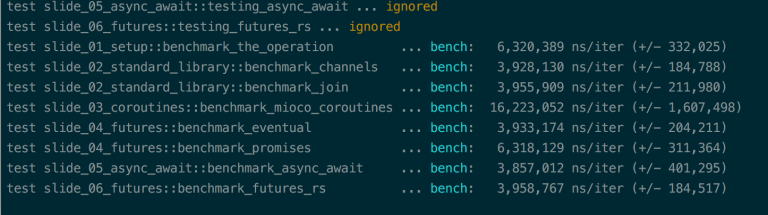
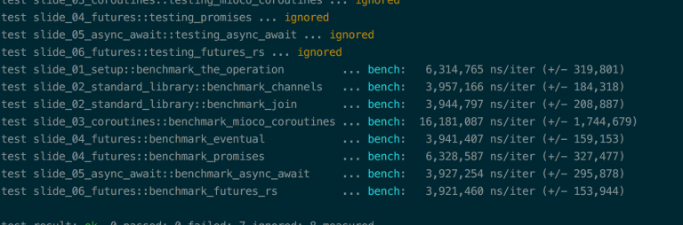

I went to RustConf this weekend. The night before the conference there was a Tokio hack night for people to learn about and start hacking on Tokio based applications and middleware.

I didn't end up getting to anything for Tokio but I did get my head wrapped around futures-rs. If you are unaware, this is a zero-cost abstraction done using traits. It is so well done that Carl Lerche deprecated his Futures implementation, Eventual, in favor of futures-rs.

This was a bit of a let down because I wanted to just start using Eventual and an Async/Await macro for it. However, with them being deprecated, I can't do so in good conscience. So I decided to implement a test and benchmark for futures-rs and added it to my repo from my concurrency talk.

After doing that and getting it working, I noticed some strange results in my benchmarks.

Here is one: 

Here is another: 

There are some interesting things to notice here. The weirdest I think is that async/await, which is built on top of eventual, is faster than eventual. This could be caused by joining the futures whereas the async/await implementation doesn't do a join under the hood. It could also be due to less allocations.

Another interesting thing is that Eventual is sometimes faster than futures-rs. I have no idea why this is, but futures-rs is faster more often at least and it probably consumes less memory.

The most important thing to me, though, is that eventual, async/await, and futures-rs regularly outperform standard library channels/threads. Typically they don't all do so in the same set of benchmarks, but over an aggregate there is definitely a pattern.

I hope you found this as interesting as I did. I plan on actually aggregating a bunch of results together to get a clearer picture, but that will be another blog post since I will have to do some extra work to parse the command line output. Thanks for reading.
