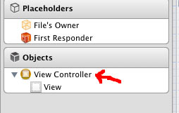

I am working on an iOS app that will be ready soon.  Unfortunately, after updating to Xcode from 4.4 to 4.5 I encountered an error, UIViewControllerHierarchyInconsistency.  I am guessing it is more to do with changing to the iOS 6 SDK.

There were some stackoverflow questions regarding this error, but none of them helped me.

I found it had to do with an extraneous view controller in the xib.

After deleting the view controller, the project compiled fine.  I had set up this xib before I fully understood iOS development, and this looks obviously wrong now.  However, the project compiled and ran fine previously, which made it a hard bug to track down.

Hopefully, this saves others the time it took me to fix the issue.
